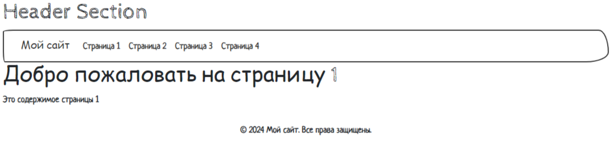

#### В данном репозитории содержатся выполненные задания к урокам по теме:
# DJ0x. Фреймворк Django
## DJ02. Создание приложения и работа с моделями
#### В соответствии с задачей поставленной в домашнем задании, был доработан сайт созданный в предыдущем уроке
#### Разработана базовая конфигурация сайта
* **Создан шаблон base.html**
* **Созданы два модуля menu.html и footer.html** (подключены в base.html с помощью include)
* **Созданы 4 страницы: page1–4.html** (расширяют шаблон base.html и наследуют оба модуля)
* Для стилизации была использована CDN-библиотека Bootswatch - Sketchy
###### (Для запуска проекта откройте терминал и выполните команду: python manage.py runserver)

## DJ01. Введение в Django и создание проекта
####  В соответствии с задачей поставленной в домашнем задании, создан новый Django-проект
* Реализовано приложение myapp: по адресам http://127.0.0.1:8000/test/ и http://127.0.0.1:8000/data/ отображаются страницы с разным содержимым
###### (Для запуска проекта откройте терминал и выполните команду: python manage.py runserver)
